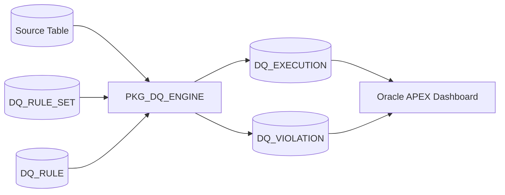
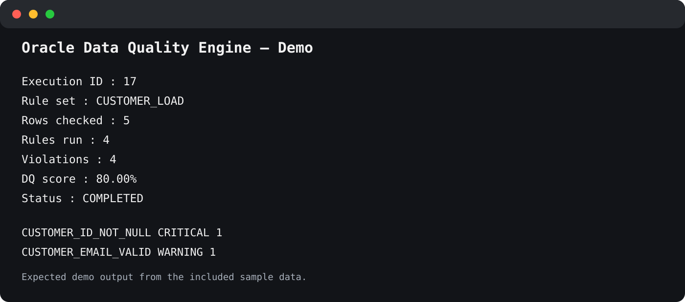
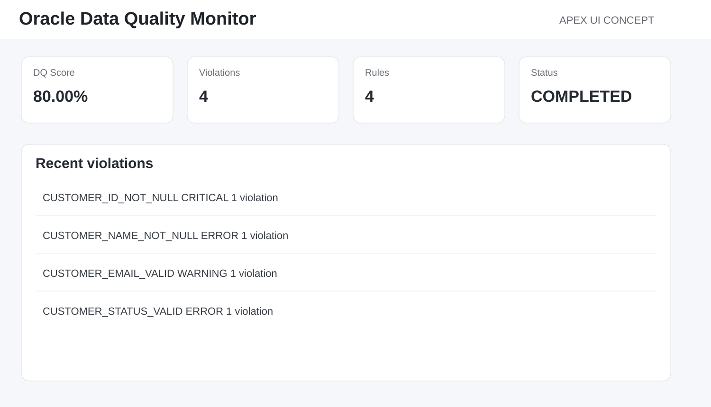

# Oracle Data Quality Engine + APEX Dashboard

<p align="center">
  
  
  
  
</p>

> **Metadata-driven Oracle data quality rules with an APEX monitoring layer.**

## Architecture



<p align="center"></p>

A configurable, metadata-driven data quality engine implemented in Oracle SQL and PL/SQL, with an Oracle APEX dashboard design for operational monitoring.

## Use case

Instead of hard-coding validation logic in every ETL procedure, rules are stored as metadata.

Example rules:

```text
CUSTOMER_ID_NOT_NULL
CUSTOMER_NAME_NOT_NULL
CUSTOMER_EMAIL_VALID
CUSTOMER_STATUS_VALID
```

A rule stores the condition that identifies invalid rows. For example:

```sql
email_address is not null
and instr(email_address, '@') = 0
```

## Main objects

- `DQ_RULE_SET` — groups related rules.
- `DQ_RULE` — stores rule definitions and failure conditions.
- `DQ_RULE_SET_MEMBER` — maps rules to sets.
- `DQ_EXECUTION` — stores execution history and DQ score.
- `DQ_VIOLATION` — stores row-level violations.
- `PKG_DQ_ENGINE` — executes configured rule sets.

## Installation

```sql
@install.sql
```

## Quick start

```sql
declare
    l_execution_id number;
begin
    l_execution_id := pkg_dq_engine.run_rule_set(
        p_rule_set_code => 'CUSTOMER_LOAD'
    );

    dbms_output.put_line('Execution ID = ' || l_execution_id);
end;
/
```

Or run:

```sql
@tests/01_run_customer_rules.sql
@tests/02_reporting_queries.sql
```

## Data Quality Score

The demo uses a deliberately transparent formula:

```text
DQ Score = 100 - (violations / evaluated checks * 100)
```

More advanced implementations can introduce severity weighting, thresholds, SLAs and domain-specific scoring.

## APEX Dashboard

The backend is fully usable without APEX. APEX is an operational layer for:

- latest DQ score;
- violations by severity;
- violations by rule;
- DQ trend;
- execution history;
- violation drill-down;
- rule maintenance.

The repository contains a page-by-page build guide in [apex/README.md](apex/README.md).

### APEX UI concept

The image below is a **design concept**, not a screenshot of a deployed APEX application.

<p align="center"></p>

After deploying the application, this concept image can be replaced with real runtime screenshots.

## Design & Engineering Decisions

### Store rules as metadata
Rules live in `DQ_RULE` rather than being hard-coded into the execution package. This makes the engine configurable and reusable.

### Define rules as failure conditions
Each rule describes the rows that are invalid. This makes evaluation simple and transparent.

### Group rules into reusable rule sets
Different processing contexts can use different validation sets such as customer, account or transaction loads.

### Capture violations at row level
The engine stores the business key, rule, severity and timestamp, allowing APEX drill-down and operational investigation.

### Separate execution metadata from configuration
`DQ_EXECUTION` stores runtime history while `DQ_RULE` stores configuration.

### Use dynamic SQL deliberately
Metadata-driven predicates require dynamic SQL. This is powerful, but production systems should restrict rule maintenance and validate allowed expressions.

### Keep APEX separate from the core engine
The PL/SQL backend can be used by ETL jobs, schedulers, REST APIs or APEX without coupling business logic to the UI.

### Keep scoring understandable
The first version prioritizes explainability over a complex scoring algorithm.

## Security Considerations

Because the engine evaluates configured expressions dynamically:

- rule maintenance should be restricted to trusted users;
- target objects should be allowlisted in production;
- expressions should be reviewed before activation;
- schema privileges should follow least privilege;
- a future version can replace free-form SQL with a constrained rule DSL.

## Key Takeaways

- Metadata-driven validation reduces duplicated PL/SQL logic.
- Data-quality systems need both aggregate metrics and row-level evidence.
- Dynamic SQL provides flexibility but must be governed carefully.
- APEX works well as an operational layer over reusable PL/SQL services.
- Separating configuration, execution history and violations creates a clearer architecture.

## Skills demonstrated

Oracle Database · SQL · PL/SQL · Oracle APEX · Data Quality · Dynamic SQL · ETL Validation · Metadata-Driven Design

## Possible extensions

- weighted scoring by severity;
- thresholds and SLA alerts;
- rule versioning;
- scheduled execution;
- profiling;
- ORDS REST API;
- reconciliation integration;
- ETL Batch Framework integration.

## LinkedIn

A LinkedIn-ready project entry is available in [docs/linkedin-project.md](docs/linkedin-project.md).

## License

MIT License. See [LICENSE](LICENSE).
